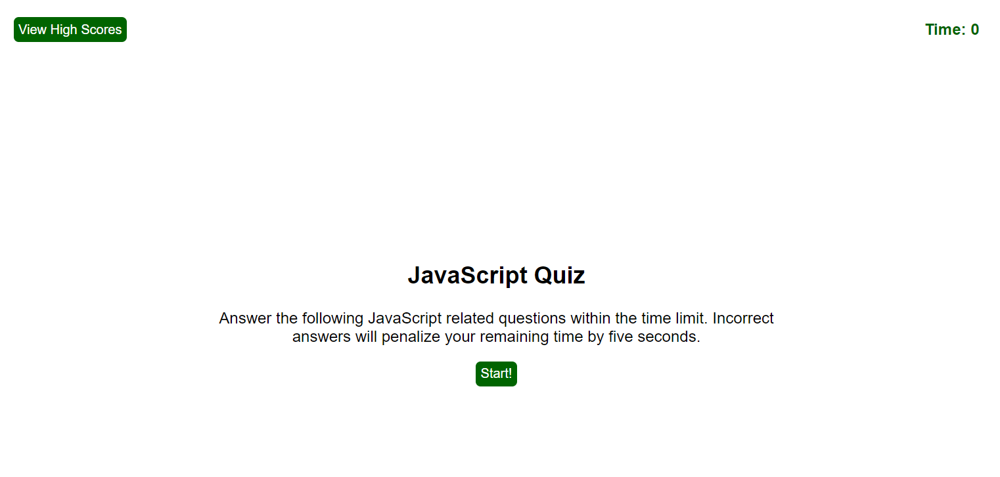

# Coding Quiz

https://jpd61.github.io/code-quiz/

(a lot of googling - making progress)

As much as I want this to look like the class example, being a Baylor Bear football player, I cannot use Purple!

## Research

https://developer.mozilla.org/en-US/docs/Web/JavaScript/Reference/Global_Objects/Array/from

https://www.w3schools.com/cssref/sel_nth-of-type.asp

https://teamtreehouse.com/community/dont-understand-the-meaning-of-functione

https://stackoverflow.com/questions/35936365/what-exactly-is-the-parameter-e-event-and-why-pass-it-to-javascript-functions

https://www.w3schools.com/js/js_arrow_function.asp

https://medium.com/javascript-in-plain-english/what-does-the-question-mark-mean-in-javascript-code-353cfadcf760

https://www.geeksforgeeks.org/ternary-operator-question-mark-and-colon-in-javascript/

https://developer.mozilla.org/en-US/docs/Web/JavaScript/Reference/Global_Objects/Array/from